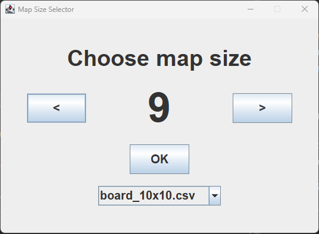
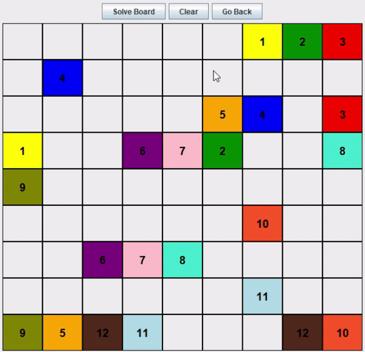

# Numberlink Game

Numberlink is a challenging puzzle game where the objective is to connect pairs of numbers on a grid without crossing the paths.

## Getting Started

### Prerequisites

To run the Numberlink game, you will need:
- Java Runtime Environment (JRE) or Java Development Kit (JDK) version 17 or higher.

### Running the Game

1. Clone the repository or download the source code.
2. Compile the code using your preferred Java compiler or IDE.
3. Run the `Game` class to start the game.

## Game Rules

- Connect pairs of the same number with a continuous line.
- Lines must not cross or overlap with each other.
- All cells on the grid must be filled with a line.
- Lines can only be drawn horizontally or vertically, not diagonally.
- Lines can't turn creating 2x2 fields - the turn making the line fit tight to itself is forbidden. 

## How to Play

When you start the game, you are greeted with a screen to select the board size or load a map from a CSV file. Click 'OK' to generate a new map or load an existing one.

The gameplay interface allows you to interact with the game board:
- Click on a cell with a number to begin drawing a path.
- Use the keyboard arrows to extend the path from the selected number.
- Click on the same number cell to undo a path.
- Use the 'Clear' button to remove all paths from the board.
- Press the 'Solve Board' button to display the solved board.

## Game Features

- **Board Generation**: A pseudo-random generator creates the game board based on geometric patterns of paths to ensure solvable puzzles.
- **Solver**: An integrated solver uses depth-first search (DFS) with backtracking to solve the puzzle, pruning paths that violate the game's rules.
- **Save/Load**: Generated boards are automatically saved in files in format `fileName_{size}x{size}.csv` based on their size. You can also load existing maps from CSV files.

## Authors

List of contributors:

- **Wojciech Kielich** - _game controls, general game model structure and gui implementation_ 
- **Adrian Lis** - _pseudo-random map generator_ 
- **Tymoteusz Walc** - _map solver, general game model structure and gui implementation_

## License

This project is open-source and available under the MIT License

## Acknowledgments
- Inspired by the classic Numberlink puzzles.
